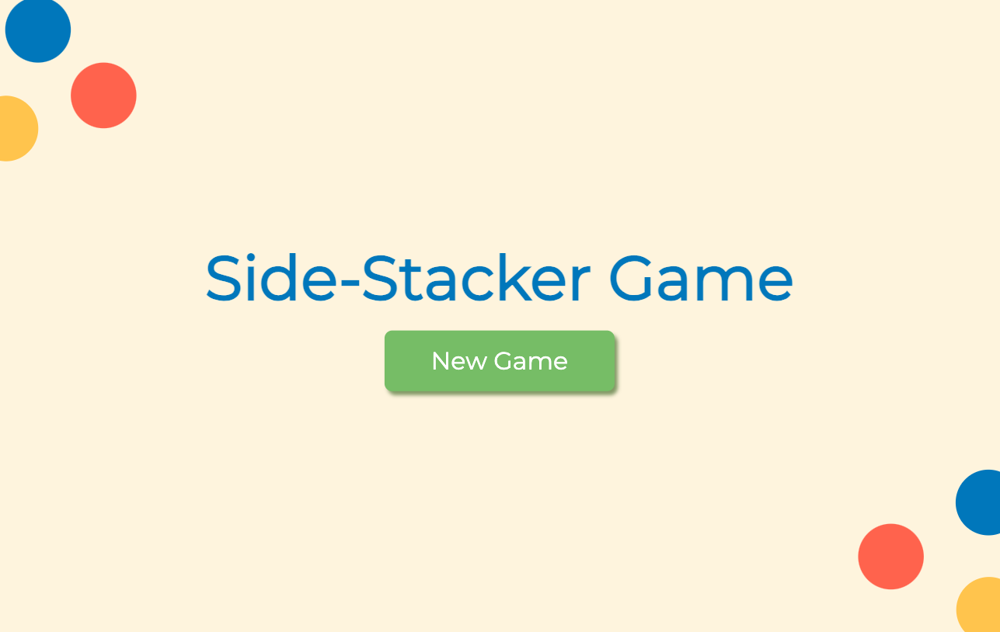
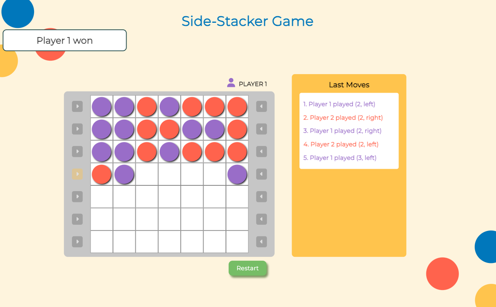
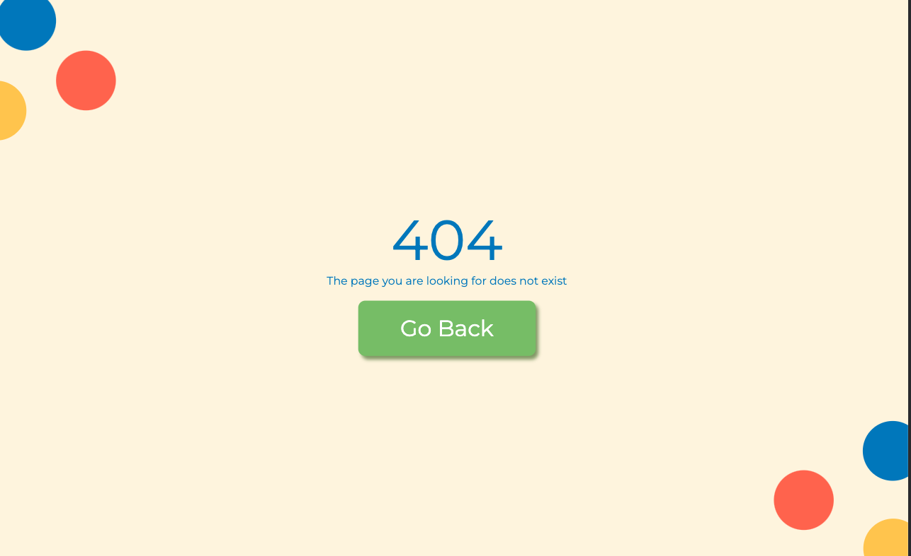

# The Side-Stacker Game - Frontend

The Side-Stacker Game is a 2-player game in which the pieces stack on top of each other, and the game ends when there are no spaces left available, or when a player has four consecutive pieces on a diagonal, column, or row.

The full project consists in two parts:

- A frontend developed using React with TypeScript
- A backend developed using NodeJS and TypeScript

Both projects connect each other real time using socket.io implementations.

## Quickstart

Prerequisites:
[Node and NPM](https://docs.npmjs.com/downloading-and-installing-node-js-and-npm) or [Docker](https://docs.docker.com/get-docker/) and [Docker-compose](https://docs.docker.com/compose/install/#install-using-pip)

You can run the project locally in two ways:

### `Using NPM`

In the root directory of the project, you can run:

- npm install -> install the dependencies
- npm start -> runs the project in the port 3000

Open [http://localhost:3000](http://localhost:3000) to view it in the browser.

The page will reload if you make edits.\
You will also see any lint errors in the console.

You can also test the project using the following command:

- npm test

This will run the unit tests for the project using Jest and React Testing Library. The coverage of the tests in this project is more than 80%.

To build the project you can run:

- npm run build

and then:

- npm start -> runs the transpiled bundle

This project was created using Create React App. You can learn more in the [Create React App documentation](https://facebook.github.io/create-react-app/docs/getting-started).

To learn React, check out the [React documentation](https://reactjs.org/).

### `Using Docker`

You can also run this project using Docker and Docker Compose.
In the root directory of the project, you first need to set the environment variables in a .env file (as shown in the .env.example file):

CHOKIDAR_USEPOLLING=
REACT_APP_BACKEND_URL=

Once the environment variables are set, you can run:

- docker compose -f docker/docker-compose.yml --env-file ./.env up

This will bootstrap and expose the container to http://localhost:3000

### The Game

The game has three main views:

The Home View from which you can start the game (remember you need to players i.e. two tabs of the application open)

And the board, in which you can play using the arrows on each side of the board. The moves board will show the last 5 moves made in the game

You can always use the restart button to start a new game with the same two players.

There is also a not found page to redirect whenever you enter a wrong url in the game

## `Caveats`

- When one of the players disconnects (or restarts the page) the game is closed
- When the game is restarted the board is automatically updated
- Each move is real time and you don't need to reload the page to see the changes
